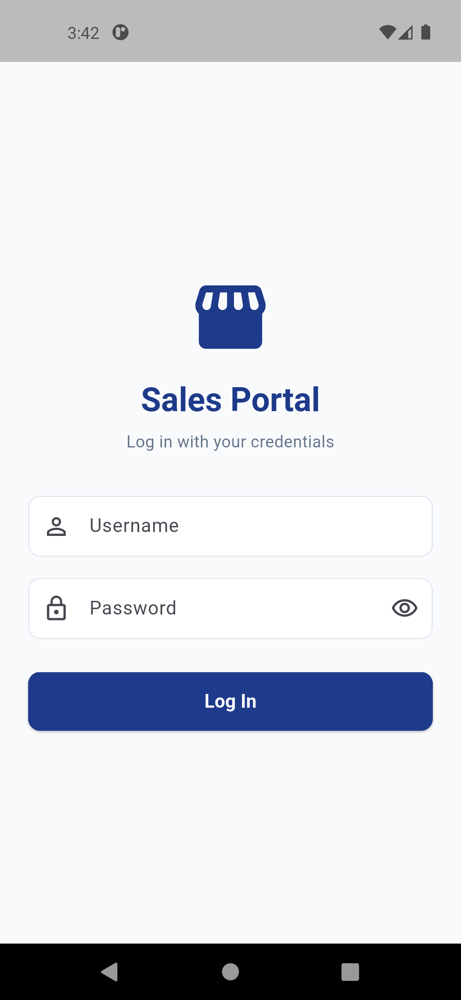
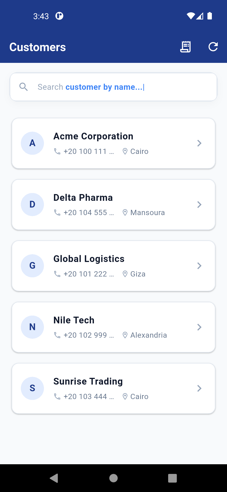
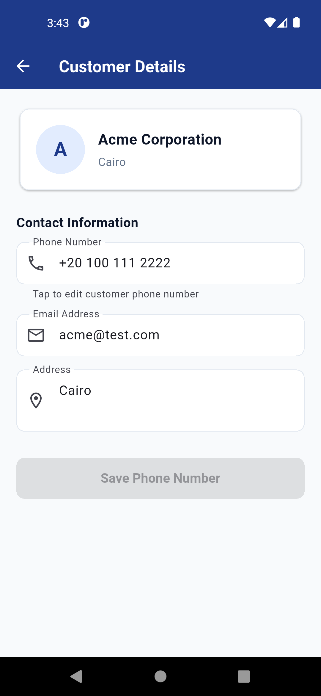
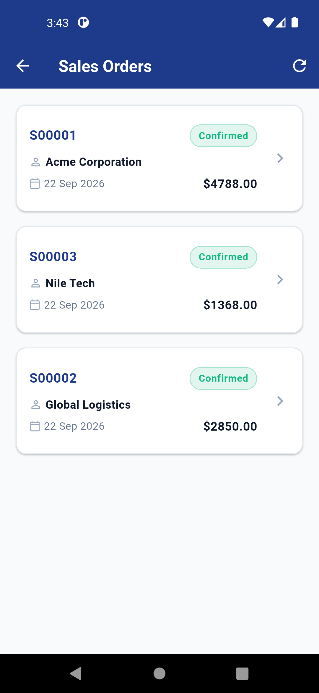
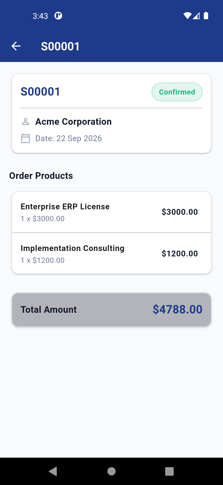
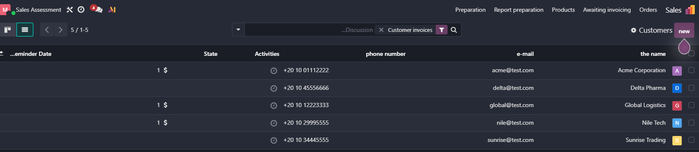
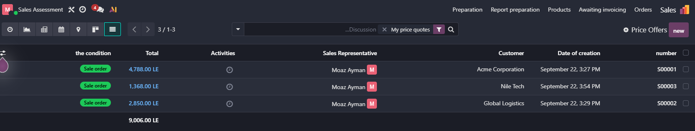

# Odoo Sales Mobile Application

A Flutter mobile application built for enterprise sales teams. The application features **Odoo JSON-RPC integration using Odoo's standard common.authenticate and object.execute_kw services**, with offline-first capabilities, automatic data synchronization, Clean Architecture, and Cubit state management.

---

## Application & Odoo Backend Screenshots

### Mobile Application User Flow

| 1. Authentication | 2. Customer List (Home) | 3. Customer Details |
| :---: | :---: | :---: |
|  |  |  |

| 4. Sales Orders List | 5. Sales Order Details |
| :---: | :---: |
|  |  |

### Odoo ERP Backend Verification

The screenshots below verify live synchronization between the mobile application and the Odoo ERP backend:

| Odoo Backend: Customers (`res.partner`) | Odoo Backend: Sales Orders (`sale.order`) |
| :---: | :---: |
|  |  |
| **Customer Data Sync**: Verification of customer records queried directly from Odoo (`res.partner`) with `customer_rank > 0`. | **Sales Order Sync**: Verification of sales orders and order confirmations (`action_confirm`) reflected directly in the Odoo backend. |

---

## Assessment Coverage

| Requirement | Implementation Status & Details |
| :--- | :--- |
| **Odoo Authentication** | Authenticates against Odoo via `common.authenticate` using login credentials entered at runtime. |
| **Customer List** | Queries `res.partner` with domain `[('customer_rank', '>', 0)]`. |
| **Customer Search** | Live client-side and server-side search filtering by partner name. |
| **Customer Details** | Displays customer profile (Name, Phone, Email, Address, City). |
| **Update Customer Phone** | In-place phone number editing synced back to Odoo via `res.partner.write`. |
| **Offline Cached Customers** | Local storage caching via `SharedPreferences` for offline browsing. |
| **Offline Edits & Sync** | Pending updates saved offline and automatically synced upon network restoration. |
| **Internal User Detection** | Checks user groups for `base.group_user` to grant access to sales order management. |
| **Sales Orders List** | Displays sales orders (`sale.order`) with order numbers, customer names, totals, and state badges. |
| **Sales Order Details** | Detailed view showing line items (`sale.order.line`), quantities, unit prices, and subtotals. |
| **Confirm Sale Orders** | Slide-to-confirm action invoking `action_confirm` on Odoo to transition quotations to confirmed sales orders. |

---

## Features & Functional Requirements

### 1. Authentication & Session Management
- **Odoo Credential Authentication**: Authenticates users using credentials entered on the Login screen (Odoo username and Odoo password).
- **Role-Based Access Control**: Detects internal sales users using `base.group_user` to conditionally grant access to sales order management.
- **Error Handling**: Displays feedback banners for invalid credentials or network failures.

### 2. Customer Management (`res.partner`)
- **Filtered Customer Querying**: Enforces strict Odoo domain filtering where `customer_rank > 0`.
- **Customer Overview**: Displays essential partner details: Name, Phone Number, and City.
- **Interactive Live Search**: Filter clients by name in real time.
- **Customer Profile**: Detailed view including Name, Phone, Email, and Address.
- **In-Place Phone Updating**: Allows updating customer phone numbers and saving changes back to Odoo.

### 3. Offline Handling & Auto-Sync
- **Local Data Caching**: Offline viewing of cached customers using persistent local storage (`SharedPreferences`).
- **Network Status Detection**: Real-time network monitoring via `connectivity_plus` with visual offline status indicator.
- **Pending Sync Queue**: Edits made offline are marked with a `Pending Sync` badge and stored locally.
- **Automatic Background Sync**: Pending updates automatically synchronize with Odoo once internet connection is restored.

### 4. Sales Orders Workflow (`sale.order`)
- **Sales Orders Dashboard**: Accessible to internal users (`base.group_user`). Displays Order Number, Customer Name, Order Date, Total Amount, and Status Badge (`Quotation` vs `Confirmed`).
- **Order Details**: Shows line items, quantities, unit prices, line subtotals, and total amounts.
- **Swipe-to-Confirm (`slide_to_act`)**: Slide gesture to convert draft quotations to confirmed sale orders (`action_confirm`).
- **Visual Feedback**: Micro-interaction feedback upon successful order confirmation.

---

## Architecture & Project Structure

The project follows **Clean Architecture** with a **Feature-First Structure**, **Cubit** state management, and the **Repository Pattern** separating remote and local data sources for robust offline synchronization.

```
lib/
├── core/                         # Shared utilities, constants, & network layer (Odoo JSON-RPC)
│   ├── constants/                # App colors and styling tokens
│   ├── errors/                   # Exception and Failure definitions
│   ├── network/                  # Odoo JSON-RPC HTTP Client
│   ├── routing/                  # Navigation routes
│   ├── theme/                    # Material 3 theme configuration
│   ├── utils/                    # Date formatters & Skeleton loaders
│   └── widgets/                  # Reusable UI components
│
└── features/                     # Feature modules
    ├── auth/                     # Authentication
    │   ├── data/                 # Models, Remote Data Source, Repository Implementation
    │   ├── domain/               # Entities, Repository Interfaces, Use Cases
    │   └── presentation/         # Cubit, State, Pages
    │
    ├── customers/                # Customer Management
    │   ├── data/                 # Customer Model, Local/Remote Data Sources, Repository
    │   ├── domain/               # Customer Entity, Repository Interface, Use Cases
    │   └── presentation/         # Cubit, State, Pages, Widgets
    │
    └── sales_orders/             # Sales Orders
        ├── data/                 # Sales Order Model, Remote Data Source, Repository
        ├── domain/               # Sale Order & Line Entities, Use Cases
        └── presentation/         # Cubit, State, Pages, Widgets
```

---

## Odoo Models & Operations

The application communicates directly with Odoo via standard JSON-RPC endpoints:

- **`res.partner`**:
  - `search_read`: Fetches customer list using domain `[('customer_rank', '>', 0)]`.
  - `write`: Updates customer phone number.
- **`sale.order`**:
  - `search_read`: Fetches sales order headers.
  - `action_confirm`: Confirms draft sales orders.
- **`sale.order.line`**:
  - `search_read`: Fetches line item details for sales orders.

---

## Technical Notes

- **JSON-RPC over HTTPS**: Communication with Odoo is handled via JSON-RPC protocol over HTTPS using standard Odoo endpoints (`/jsonrpc`).
- **In-Memory Credentials**: Runtime authentication credentials entered at login (Odoo username and password) are kept in memory for the authenticated session to execute `object.execute_kw` calls.
- **No Odoo API Key Required**: No Odoo API key or hardcoded tokens are required or used by the application.
- **Offline Cache & Sync**: Supports offline customer caching and automatic background synchronization of pending customer phone updates when reconnecting.

---

## Design Decisions & Technical Rationale

| Design Decision | Technical Rationale |
| :--- | :--- |
| **Clean Architecture** | Decouples data sources from presentation. Data sources are defined as abstract contracts (`AuthRemoteDataSource`, `CustomerRemoteDataSource`), enabling seamless switching between data sources without changing UI code. |
| **BLoC / Cubit Pattern** | Provides explicit, predictable state management (Loading, Empty, Loaded, Error, Saving, Success) and prevents unnecessary rebuilds using `Equatable`. |
| **Repository Pattern & Offline Sync** | Ensures usability when offline. Reads fallback to local cache, and writes queue locally until back online. |
| **Swipe-to-Confirm Gesture** | Confirming a Sales Order in Odoo changes system state and stock allocation. `SlideAction` requires deliberate user interaction to prevent accidental taps. |
| **Skeleton Loaders** | Replaces default spinners with layout-matching shimmer placeholders for smooth loading states. |

---

## Tech Stack & Dependencies

- **Framework**: [Flutter 3.35.1](https://flutter.dev/) (Dart SDK `3.9.0`)
- **State Management**: [`flutter_bloc`](https://pub.dev/packages/flutter_bloc) & [`equatable`](https://pub.dev/packages/equatable)
- **Persistence**: [`shared_preferences`](https://pub.dev/packages/shared_preferences)
- **Connectivity**: [`connectivity_plus`](https://pub.dev/packages/connectivity_plus)
- **UI Components**: [`slide_to_act`](https://pub.dev/packages/slide_to_act)

---

## Setup & Running the Project

### Prerequisites
- Flutter SDK (`3.35.1`)
- Dart SDK (`3.9.0`)

### Getting Started

1. Clone the repository:
   ```bash
   git clone https://github.com/moaz-abdeltawab92/sales_app.git
   cd sales_app
   ```

2. Get dependencies:
   ```bash
   flutter pub get
   ```

3. Run static analysis:
   ```bash
   flutter analyze
   ```

4. Run the app:
   ```bash
   flutter run
   ```
